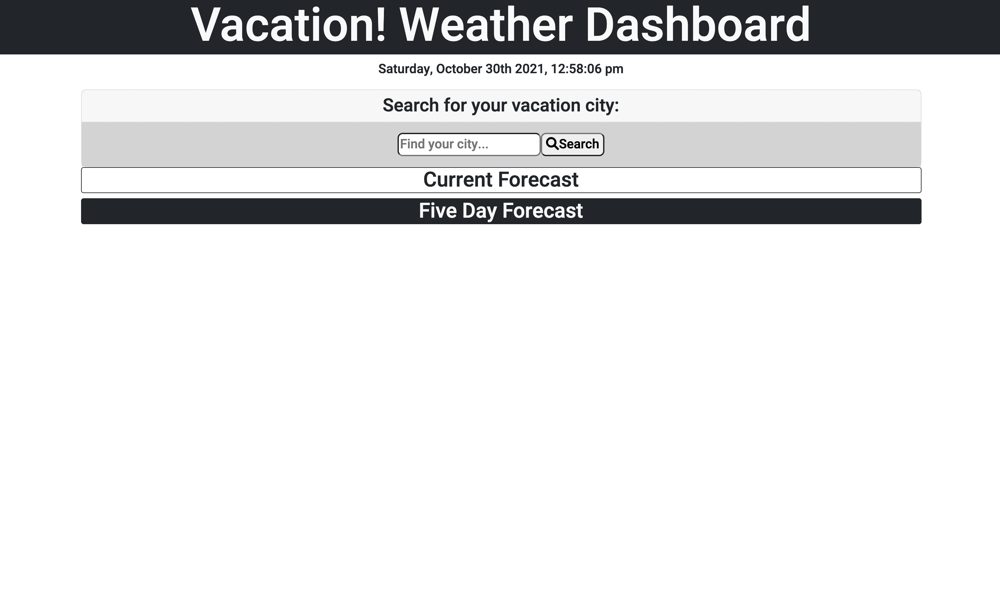
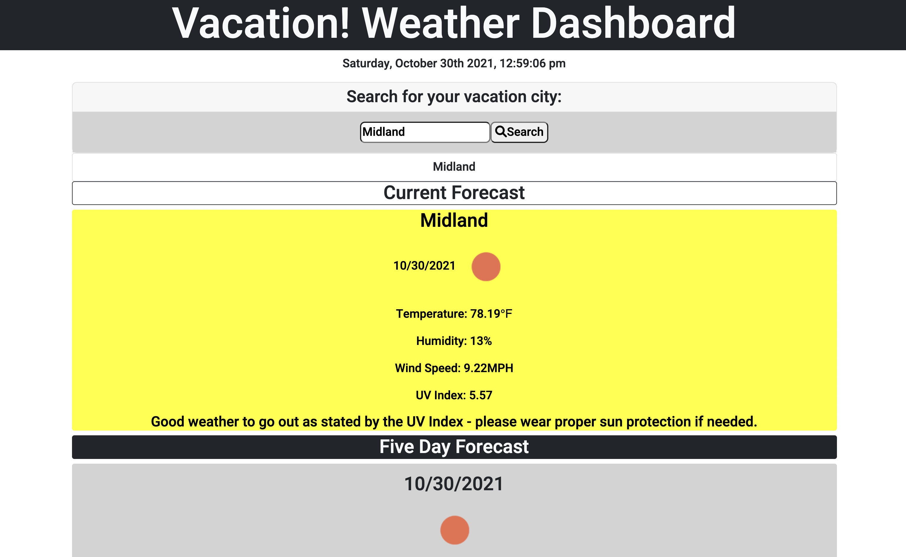
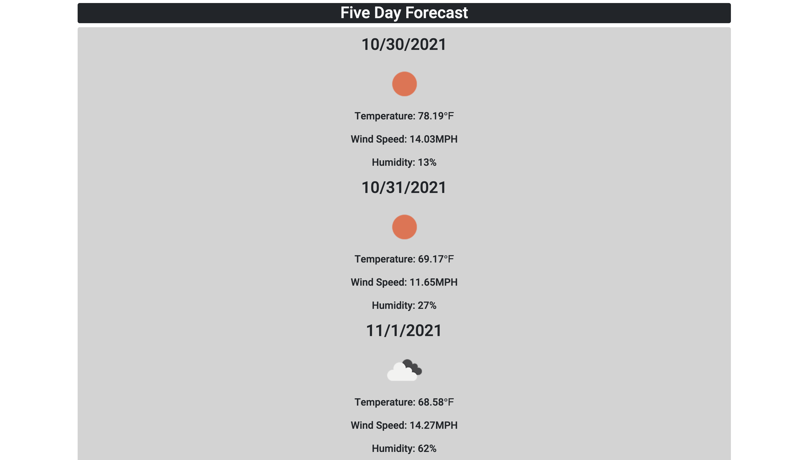
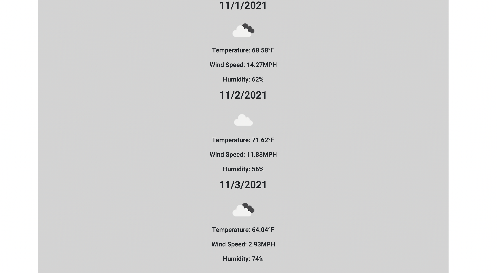
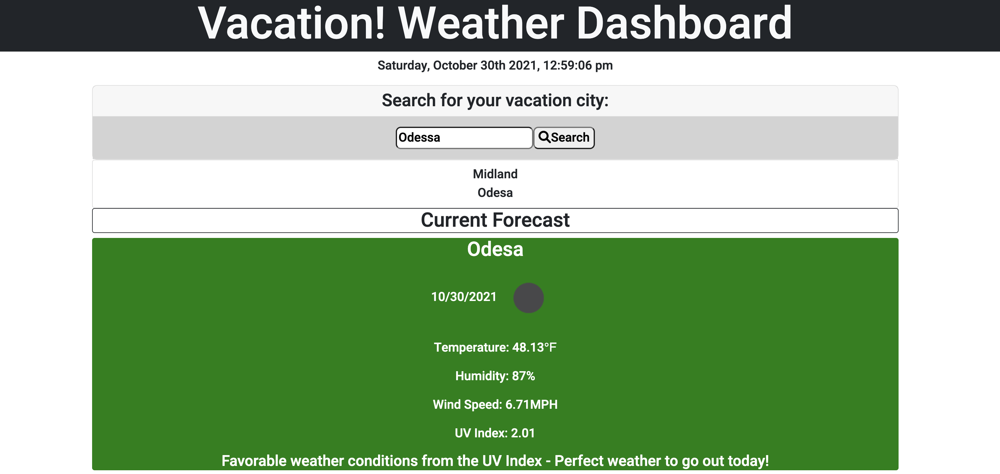
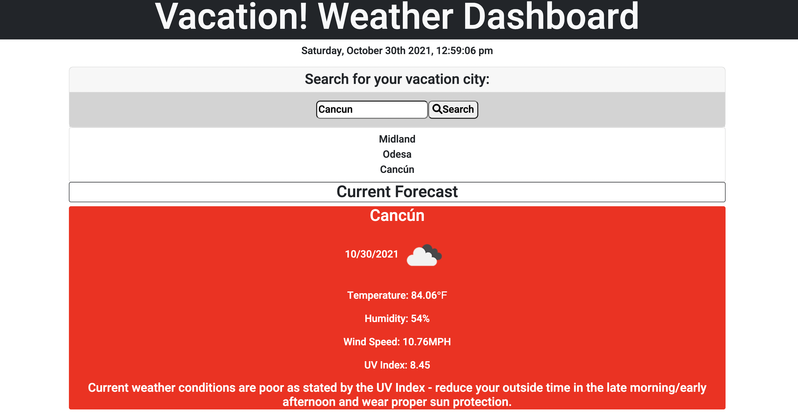
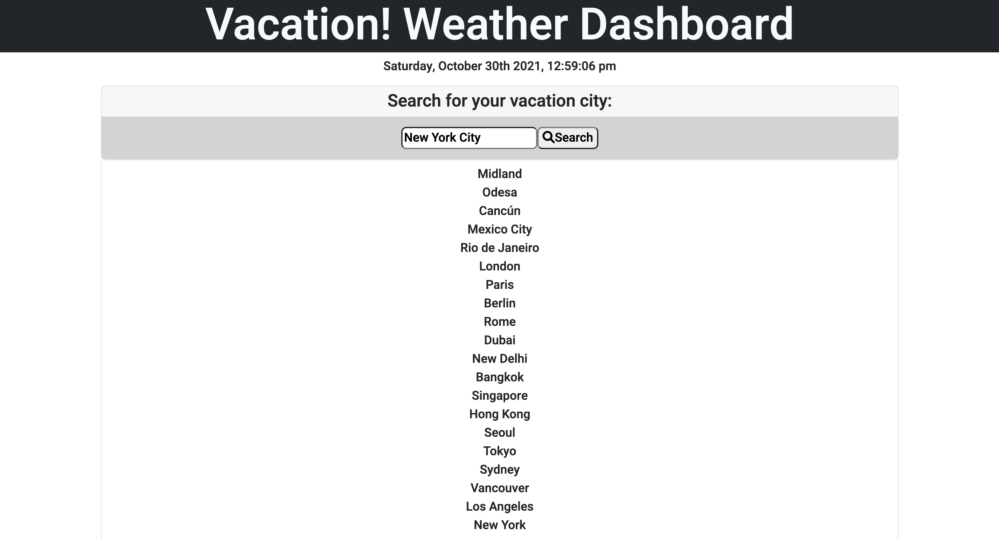
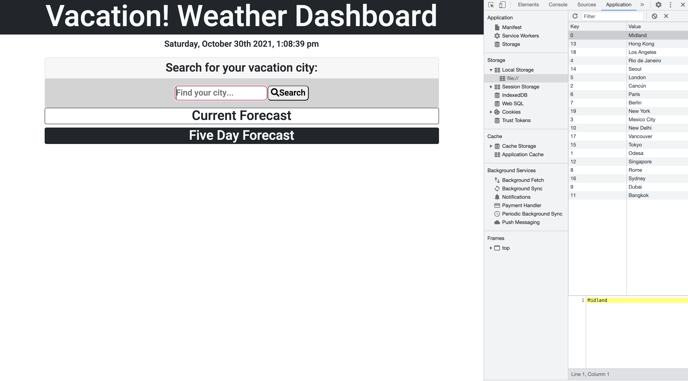
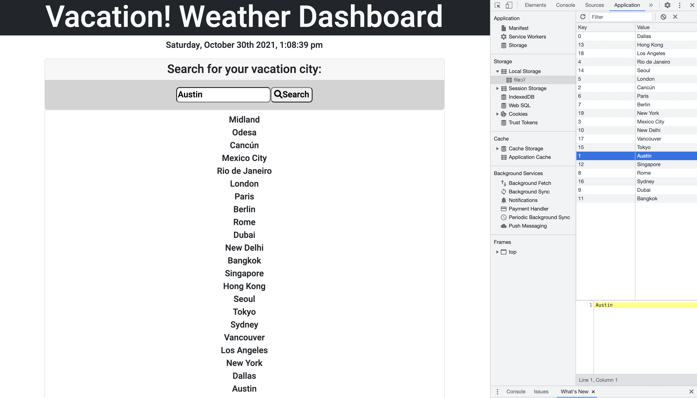

# Vacation! A Weather Dashboard
## Application Purpose
Vacation! is a weather dashboard that allows a traveler (the user respectively) to see the local and five day weather for their searched location, intended to allow the traveler to plan their vacation when seeing the forecast for their upcoming trip. When the user enters the name of the city they want to travel to, they are presented with the current and future weather conditions of the searched city. The searched city is also implemented in the user's local storage on the browser and is added on a list. 

The current weather forecast is presented with the name of the city, today's date, an icon showing the weather conditions, the temperature (in fahrenheit degrees(°F)), the humidity percentage, the wind speed (in miles per hour), and the UV index which presents its status on the entire forecast card. The UV index respectively shows the conditions in a specific color and provides a statement for the user on using protective measures from the sun. Favorable (in green) details perfect conditions, Moderate (in yellow) specifies good conditions but users to use proper sun protection, and Severe (in red) details poor condtions and for users to seriously take proper protective measures and reduce outside time from the late morning to the early afternoon.

Below the current weather forecast, the five-day forecast is displayed, showing the upcoming weather conditions for the respective city they searched for. The date is displayed followed by the icon of its predicted weather conditions, temperature (in fahrenheit degrees(°F)), the wind speed, and the humidity. 

## Application develop with 
* HTML
* JavaScript 
* CSS 
* Bootstrap - implements the responsive web design of this weather application. Desktop friendly and mobile friendly. 
* jQuery - used to call the functions with the use of JSON terms and assets of the OpenWeather One Call API url. 
* Moment.js - implements visible current time format on the header.
* OpenWeather One Call API - used to collect weather data from different locations and is used alongside jQuery to create the current forecast for the city alongside several weather conditions
* Local storage is implemented for users when a city is searched and saves up however many cities are searched by the user. The search list of cities are saved and remained on the link. However, when another city is searched, it will take the place of the first city the user searched, again implementing the number of times the user searches for cities.

## Deployed Website and GitHub Repository Link
* Deployed Website - https://trujilml.github.io/vacation-weather-dashboard/
* GitHub Repository - https://github.com/trujilml/vacation-weather-dashboard 

## Further Development Notes
* Alongside the current local storage of the cities that the user searches for, there will be the future implementation of a clear search function that allows for the user to clear their current search history in favor of looking for more cities of their future travel destination. This implementation will be helpful as it will clear out the long city search list users might have when they search for more cities. 
* I found difficulty implementing in the click function of the previous searched cities on the list-group element. Future considerations will also involving figuring out how to allow a user to choose a previous city and review its current weather and future forecast. 
* The consideration of adding a ten day weather forecast rather than the display of five days, in the case the user is planning to stay at their destination longer. 

## Screenshots 
The first four screenshots provide an example of the dashboard, once the search form is submitted, the city is shown with its daily forecast and weekly forecast respectively. The UV index in this example is presented as moderate and shows the reminder within the weather card. 
 
 
 
 
The fifth and sixth screenshot shows the favorable (green) and severe (red) examples of the UV index.
 
 
The remainder of these screenshots demonstrate the search input list, the local storage (with the page refreshed - showing the previous list still exists), and the new addition of two cities replacing the first and second searched city (Austin and Dallas replaces Midland Odessa).
 
 
 

## Special Thanks
A special thanks to the teaching assistant Vicky for helping me out with the search list as I previously ran into issues with it, including the local storage. I greatly appreciate the help alongside adding future development notes with this project. Thank you!
